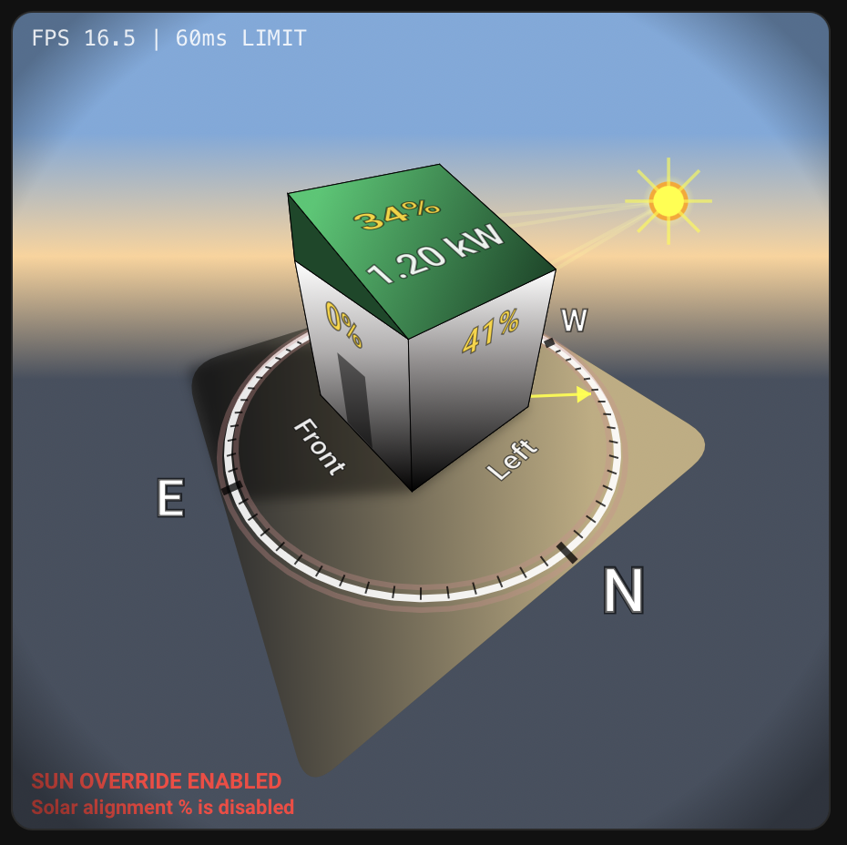

# Sunlight Visualizer 


A **Interactive Sunlight Intensity Visualizer** for your House using Home Assistant. 

The integration includes a Lovelace card that visualizes real‑time sunlight intensity on a 2.5D house. <br>
It  displays roof and wall sunlight intensity, shadows, and optional solar power (or any power sensor you select), in a single HACS install. <br>
In this new update we also included some clouds, animations and additional visual enhancements, more to come.


To enable all visual features, enter this yaml: <br>
houseStyleV2: true <br>
flatRoofEnabled: true <br>
wallWindowsEnabled: true <br>
backTreeEnabled: true <br>


Watch video:<br>
<a href="assets/rotation.mp4">
  
</a>


[](https://www.buymeacoffee.com/DefaultLogin)

[](https://github.com/hacs/integration)


What can you do with this card?
- Double tap the card to autorotate the view, tap to stop the rotation.
- Visualise current solar intensity on all walls (and the ceiling) on your house.
- Get data so you know when the sun is at its peak, when sun reaches the porch or when to close the blinds.
- Know when its time to get the coconut butter and get a great tan.
- Understand when your solar system is at its peak, or when the sun is optimally aligned to the panels / roof.

## What you get
- `sunlight_visualizer` integration (sensors + numbers + selects)
- `sunlight-visualizer-card.js` Lovelace card (auto‑registered by the integration)

## Features

☀️ **Real‑Time Sun Physics**  
Calculates wall and roof sunlight intensity based on sun azimuth/elevation, house orientation, and roof tilt.

🏠 **2.5D House Visualizer (Lovelace Card)**  
Interactive SVG card showing:
- Live sun position, rays, and floor compass
- Wall & roof intensity labels
- Roof tilt + roof direction visualization
- Real‑time shadow casting
- Auto‑rotate camera with FPS readout

📊 **Sensors for Every Surface**  
Creates intensity sensors for:
- Front / Right / Back / Left walls
- Roof (ceiling) surface
- Solar alignment percentage + status

⚙️ **Full Integration + Card in One HACS Install**  
One download installs both:
- `sunlight_visualizer` integration
- `sunlight‑visualizer‑card.js` Lovelace card

🔧 **Configurable & Test‑Friendly**  
Options include:
- House direction, roof tilt, roof direction
- Force Sun Fallback (azimuth + elevation) for testing
- Optional roof power sensor & invert option
- Camera rotation controls + auto‑rotate speed

🧭 **Compass & Orientation**  
Floor compass ring + sun direction indicator for easy real‑world alignment.

🧪 **Debug & Diagnostics**  
Includes diagnostic sensors and attributes for troubleshooting + override indicator in the card.

## Installation (HACS)
1. Add this repository to HACS (as an **Integration**).
2. Install it. HACS will place the integration under `custom_components/sunlight_visualizer`.
3. The integration **serves and auto‑registers** the Lovelace card from:
   - `/sunlight_visualizer/sunlight-visualizer-card.js`

If the resource isn’t added automatically, add it manually:
- URL: `/sunlight_visualizer/sunlight-visualizer-card.js`
- Type: `module`

## Card usage (minimal)
```yaml
type: custom:sunlight-visualizer-card
```

The card **auto‑binds** to this integration’s sensors using the marker attribute:
`sunlight_visualizer_source: "sunlight_visualizer"`.

## Camera rotation sliders
The integration also provides two camera sliders (view only):
- `number.house_camera_rotation_h` (default 225°)
- `number.house_camera_rotation_v` (default 35°)

The card auto‑binds to these via the marker attribute and `camera_rotation: "h"|"v"`.

## Force Sun Fallback (integration options)
In **Settings → Devices & Services → Sunlight Visualizer → Configure**, you can enable:
- **Force Sun Fallback** (toggle)
- **Force Sun Azimuth** (0–359°)
- **Force Sun Elevation** (−90° to 90°)

These override live sun values for testing.
When enabled, the card shows a red **SUN OVERRIDE ENABLED** indicator in the bottom-left.

## All YAML settings (grouped)
Below is the full list of configurable options. You can set any of these in YAML.

### Size & layout
```yaml
cardWidth: 450
cardHeight: 450
floorScale: 2.6
floorColor: "#2f2f2f"
faceColors:
  front: "#faf5f5ff"
  right: "#d8d2d2ff"
  top: "#13a057"
  back: "#d8d2d2ff"
  left: "#d8d2d2ff"
  bottom: "#d8d2d2ff"
```

### Integration & entity binding
```yaml
siSourceAttr: sunlight_visualizer_source
siSourceValue: sunlight_visualizer
preferIntegrationSettings: true

rotationHEntity: number.house_camera_rotation_h
rotationVEntity: number.house_camera_rotation_v
houseAngleEntity: number.house_angle

wallFrontPctEntity: sensor.sun_wall_intensity_front
wallRightPctEntity: sensor.sun_wall_intensity_right
wallBackPctEntity: sensor.sun_wall_intensity_back
wallLeftPctEntity: sensor.sun_wall_intensity_left
roofPctEntity: sensor.sun_roof_intensity

roofPowerEntity: null   # optional (auto-bound from integration if available)
roofPowerEnabled: false
roofPowerInvert: false

sunAzEntity: sensor.sun_azimuth
sunElEntity: sensor.sun_elevation
useSunEntity: false
sunEntityId: sun.sun
```

### Sun position (manual fallback)
```yaml
sunDistance: 3.0
sunAz: 135
sunEl: 55
```

### House & roof orientation
```yaml
houseAngle: 0

roofTiltEnabled: true
roofTiltDeg: 25
roofTiltFace: front     # front | back | left | right
roofTiltMax: 89
roofTiltOpacity: 1.0

roofBackEnabled: true
roofBackMix: 0.7
roofBackOpacity: 1.0

roofGradientDarkMix: 0.125
roofGradientLightMix: 1.25

roofSidesEnabled: true
roofSideMix: 0.45
roofSideOpacity: 1.0

roofCapEnabled: true
```

### Shadows
```yaml
shadowEnabled: true
shadowOpacity: 0.35
shadowBlur: 4
shadowContactOpacity: 0.12
shadowContactBlur: 2.5
shadowColor: "#000000"
shadowClipInset: 0.02
```

### Sunlight floor gradient
```yaml
sunlightEnabled: true
sunlightColor: [255, 225, 160]
sunlightOpacity: 0.7
sunlightSpread: 0.7
```

### Wall & ceiling gradients
```yaml
wallBottomMix: 0.01
wallMidMix: 0.7
wallTopMix: 1.3
ceilingDarkMix: 0.1
ceilingLightMix: 1.40
```

### Horizon & vignette
```yaml
horizonEnabled: true
horizonBase: 0.55
horizonTiltStrength: 0.65
horizonBand: 0.15
horizonTopColor: [120, 170, 220]
horizonBandColor: [255, 210, 150]
horizonBottomColor: [70, 80, 95]

vignetteEnabled: true
vignetteOpacity: 0.35
vignetteRadius: 0.65
vignetteInner: 0.85
vignetteColor: [0, 0, 0]
```

### Compass ring & arrow
```yaml
floorCompassStroke: 4
floorCompassRingBand: 0.09
floorCompassRingMiddleColor: "rgba(255,255,255,0.9)"
floorCompassRingSideColor: "rgba(210,140,140,0.345)"
floorCompassRingSideWidth: 3

floorCompassTicksEnabled: true
floorCompassTickColor: "rgba(0,0,0,0.75)"
floorCompassTickWidth: 1
floorCompassTickMajorWidth: 4
floorCompassTickLength: -0.1
floorCompassTickMajorLength: -0.2

floorCompassLabelSize: 20
floorCompassLabelInset: -0.25
floorCompassLabelScaleBoost: 1.2
floorCompassLabelScaleMin: 0.6
floorCompassLabelScaleMax: 2.0
floorCompassLabelStroke: 1

arrowScaleBoost: 0.60
floorPointerScaleMin: 0.05
floorPointerScaleMax: 1.0
floorPointerBaseWidth: 3
floorPointerBaseHead: 15
```

### Floor wall labels (Front/Right/Back/Left text on floor)
```yaml
floorWallLabelSize: 12
floorWallLabelOffset: 0.55
floorWallLabelScaleBoost: 1.2
floorWallLabelScaleMin: 0.5
floorWallLabelScaleMax: 1.8
floorWallLabelScreenLift: 6
floorWallLabelColor: "rgba(255,255,255,0.9)"
floorWallLabelStroke: "rgba(0,0,0,0.6)"
floorWallLabelStrokeWidth: 0.5
wallLabelVisibleThreshold: -0.05
```

### Surface % labels (walls + roof)
```yaml
surfaceLabelEnabled: true
surfaceLabelSize: 12
surfaceLabelScaleBoost: 1.5
surfaceLabelScaleMin: 0.6
surfaceLabelScaleMax: 1.6
surfaceLabelColor: "rgba(255,213,0,.95)"
surfaceLabelStroke: "rgba(0,0,0,0.5)"
surfaceLabelStrokeWidth: 0.5
surfaceLabelOffset: 0.03

wallPctVisibleThreshold: -0.215
wallPctAreaThreshold: 120
wallPctVerticalPos: 0.66

# Roof power label (below %)
roofPowerLabelScale: 0.85
roofPowerLabelColor: "rgba(255,255,255,0.9)"

```

### Front door notch (front wall)
```yaml
frontDoorEnabled: true
frontDoorWidth: 0.55
frontDoorHeight: 1.1
frontDoorBottomInset: 0.05
frontDoorOffset: 0.01
frontDoorColor: "rgba(0,0,0,0.55)"
frontDoorOpacity: 0.9
```

### Auto-rotate view (local only)
```yaml
autoRotateEnabledDefault: false
autoRotateSpeed: 10
autoRotateIntervalMs: 50
autoRotateTapDelayMs: 250
autoRotateStopOnFullTurn: true
autoRotateTurnCount: 1
autoRotateShowFps: true
autoRotateFpsWindowMs: 1000
autoRotateAdaptiveEnabled: true
autoRotateAdaptiveMaxIntervalMs: 1000
autoRotateAdaptiveStepMs: 10
autoRotateAdaptiveCheckMs: 1000
autoRotateAdaptiveFpsThreshold: 0.80
autoRotateCalibrateMs: 2000
autoRotateCalibrateFactor: 0.85
```
