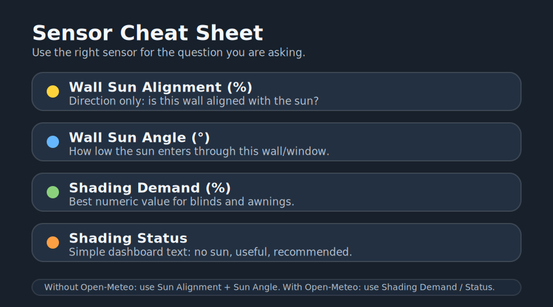
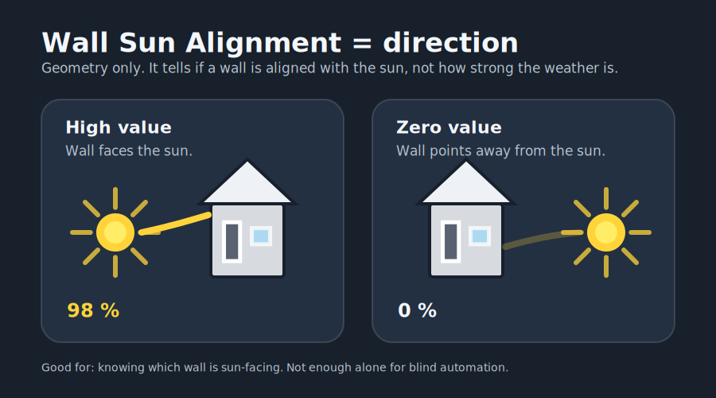
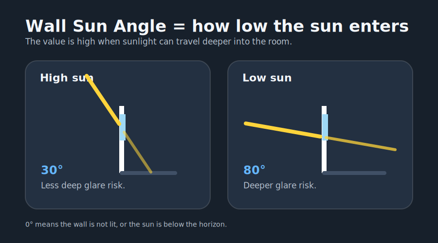
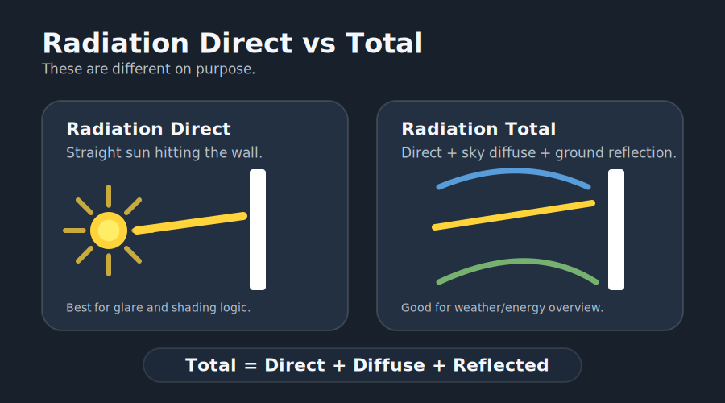
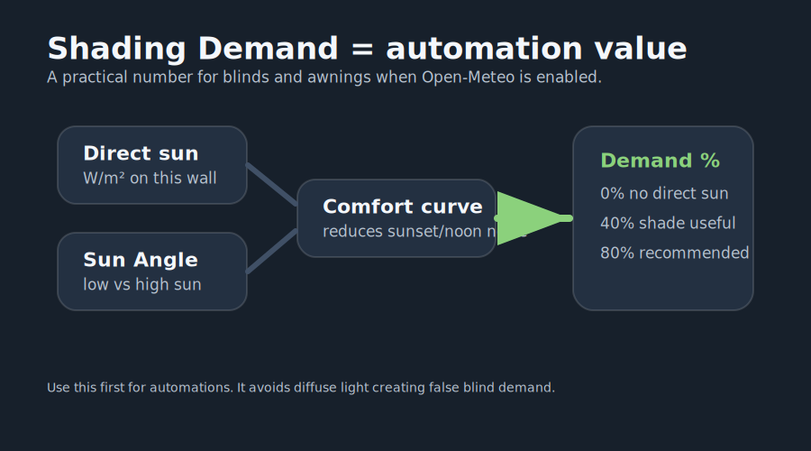
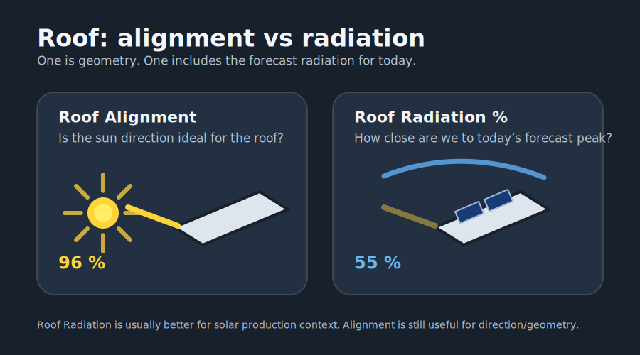

# Sunlight Visualizer


[](https://www.buymeacoffee.com/DefaultLogin)

[](https://my.home-assistant.io/redirect/hacs_repository/?owner=NoUsername10&repository=Sunlight_Visualizer&category=integration)

<br>

An interactive sunlight intensity visualizer for Home Assistant.

It includes:
- A custom integration (`sunlight_visualizer`) that calculates wall/roof sunlight intensity values that can be used in automations.
  
   - Sunscreen Alert:☀️ “UV attack incoming” Go outside and bring the sunscreen, sun reaches the pool 😎!
   - Heat-Load HVAC Prep: Pre-cool when roof or wall sunlight rises, then relax setpoint when exposure drops.
   - Solar Output Insights: Compare roof sun intensity/alignment with roof power to detect underperformance.
   - Control blinds and awnings automatically depending on the sun’s position.

<br>

Sensor information: <br>


<br>

- A Lovelace card (`custom:sunlight-visualizer-card`) that renders a 2.5D house with accurate sun, shadows, roof/wall values, optional roof power, sky effects, camera controls and Energy HUD for Solar / Home / Grid power.

  


GIF (on macOS Safari: right click + "Play animation"):
<br>


## Instant Overview
- Real-time sun physics from azimuth/elevation + house angle + roof tilt.
- Geometric sun-alignment sensors for all 4 walls + roof.
- Wall Sun Angle sensors for blind/awning logic without weather data.
- Optional Open-Meteo radiation support with 15-minute forecast data, retry handling, same-day cache fallback, and diagnostic status.
- Optional wall/roof radiation sensors: total radiation, direct radiation, shading demand/status, roof radiation percentage.
- Home location by default with optional single-dropdown `zone.*` location override and safe Home fallback.
- Roof power label for solar power (optional) with invert value support.
- Grid flow sensor support (optional) with invert sign support and bidirectional SVG power pulse.
- Energy HUD for Solar / Home / Grid / optional CAR values, with roof-alignment sub-info and small-card `(i)` mode.
- Surface `%` source selectors for wall labels and roof labels, including Open-Meteo shading/radiation values when available.
- Optional EV visuals: SVG fallback car, WebGL Smart car, WebGL Mini SUV, `evCarScale`, and automatic SVG fallback if WebGL is unavailable.
- Optional car charger power sensor with HUD `CAR` row and WebGL charger pulse.
- Utility pole + powerline visualization with segment-aware house occlusion and persistent pulse animation.
- Improved wall `%` label projection + anti-stretch behavior.
- Visuals: overhang, windows, door, roof panels, tree, EV car, adaptive shadows, sky, clouds, moon and stars.
- Auto rotate + manual camera controls + save/restore view.
- Fixed sun position, azimuth. (Rotate scene) — keep sun azimuth visually fixed and rotate the scene instead.
- Performance adaptation for slow displays.
- Localized config/options/services text (English, Swedish, Spanish, Polish).
- Test mode (if sun is down): Force Sun Fallback mode, the card displays `SUN OVERRIDE ENABLED`.

## Changelog
See [`CHANGELOG.md`](./CHANGELOG.md).

## Installation (HACS - Recommended)
[](https://my.home-assistant.io/redirect/hacs_repository/?owner=NoUsername10&repository=Sunlight_Visualizer&category=integration)

1. Add/install **Sunlight Visualizer** from HACS (**Integration** category).
2. Restart Home Assistant.
3. Go to **Settings → Devices & Services → Add Integration** and add **Sunlight Visualizer**.

### Add The Card In GUI
1. Open your dashboard.
2. Click **Edit dashboard**.
3. Click **+ Add card**.
4. Select **Sunlight Visualizer**.
5. Save.

If the card is not listed in the picker, use **Manual card** and enter:

```yaml
type: custom:sunlight-visualizer-card
```

The integration serves the card resource at:
- `/sunlight_visualizer/sunlight-visualizer-card.js`

<details>
<summary>Manual Install (Backup)</summary><br>

1. Copy `custom_components/sunlight_visualizer` into your HA config folder at:
   `/config/custom_components/sunlight_visualizer`
2. Restart Home Assistant.
3. Add **Sunlight Visualizer** in **Settings → Devices & Services**.
4. Add the card (GUI picker or manual YAML):

```yaml
type: custom:sunlight-visualizer-card
```

If needed, add card resource manually:
- URL: `/sunlight_visualizer/sunlight-visualizer-card.js`
- Type: `module`

</details>


## Geo Location Source
- No card-side geo setup is needed.
- `sunlight_visualizer` uses your Home Assistant Home location (latitude/longitude + timezone) automatically by default.
- Optional: in integration setup/options, choose a `zone.*` entity from the Zone override dropdown.
- The first dropdown option is `Use Home (default)`.
- If the selected zone is missing/unavailable, the integration safely falls back to Home coordinates.
- The card reads sun/wall/roof values from integration entities, so location is auto-configured through Home Assistant.

If your Home location is not set correctly in Home Assistant:
1. Go to **Settings**.
2. Open **Areas, Labels & Zones**.
3. Open **Zones**.
4. Edit your **Home** zone position.

This ensures accurate geo data for sun calculations.

## Most Used Settings (Start Here)
<details>
<summary>Setup options</summary><br>

These are the most important settings in integration setup/options:
- Zone override (`Use Home (default)` or a `zone.*` entity)
- House Direction preset or custom House Angle (the compass angle of the front door of your house)
- Roof Direction (`front`, `left`, `back`, `right`) and Ceiling Tilt
- Fixed sun position, azimuth. (Rotate scene)
- Update Interval
- Auto Rotate Speed
- Roof power settings:
  - Enable roof power label
  - Select roof power sensor
  - Invert value if your power sensor reports negative production
- Open-Meteo radiation sensors (optional, disabled by default)
- Remove Open-Meteo sensors when disabling (shown when Open-Meteo is currently enabled)


<br>
</details>

<details>
<summary>Configuration options</summary><br>

In integration configuration/options you can tune:
- Zone override (`Use Home (default)` or a `zone.*` entity)
- Ceiling Tilt
- House Angle
- Camera Rotation H / V (default view)
- House Direction preset
- Roof Direction
- Fixed sun position, azimuth. (Rotate scene)
- Update Interval
- Auto rotate speed
- Roof power source + invert
- Open-Meteo radiation support:
  - Enable/disable forecast radiation sensors
  - Optional cleanup of Open-Meteo/radiation entities when disabling
- Force Sun Fallback:
  - Enable/disable override
  - Set forced sun azimuth/elevation for testing


<br>
</details>

<details>
<summary>Sunlight and radiation sensors</summary><br>

Core sensors are always created:
- `sensor.front_wall_sunlight`, `sensor.left_wall_sunlight`, `sensor.back_wall_sunlight`, `sensor.right_wall_sunlight` — friendly names are `Front/Left/Back/Right Wall Sun Alignment`. These are geometric wall-facing percentages.
- `sensor.front_wall_sun_angle`, `sensor.left_wall_sun_angle`, `sensor.back_wall_sun_angle`, `sensor.right_wall_sun_angle` — vertical window-entry angle (°). A higher value means lower sun and deeper light entering the room. Returns `0°` when the wall is not lit.
- `sensor.roof_sunlight` — friendly name `Roof Sun Alignment`, the geometric roof-facing percentage.
- `sensor.roof_sunlight_alignment_percentage` — current roof alignment versus best possible alignment for today (%).
- `sensor.roof_sunlight_alignment_status` — human-readable status for roof alignment trend.
- `sensor.sun_azimuth`, `sensor.sun_elevation`, `sensor.sun_coordinates` — diagnostic sun/location data.

For blinds and awnings without Open-Meteo, a good starting point is to combine wall sun alignment and wall sun angle, for example: close when wall sun alignment is above `20%` and wall sun angle is above `45°`.

When Open-Meteo radiation is enabled, extra sensors are added:
- `sensor.left_wall_radiation_total`, `sensor.right_wall_radiation_total`, `sensor.front_wall_radiation_total`, `sensor.back_wall_radiation_total` — total estimated wall radiation (`direct + diffuse + reflected`).
- `sensor.left_wall_radiation_direct`, `sensor.right_wall_radiation_direct`, `sensor.front_wall_radiation_direct`, `sensor.back_wall_radiation_direct` — direct beam radiation hitting each wall.
- `sensor.left_wall_shading_demand`, `sensor.right_wall_shading_demand`, `sensor.front_wall_shading_demand`, `sensor.back_wall_shading_demand` — automation-friendly direct-sun demand percentage.
- `sensor.left_wall_shading_status`, `sensor.right_wall_shading_status`, `sensor.front_wall_shading_status`, `sensor.back_wall_shading_status` — dashboard-friendly text guidance such as `No direct sun`, `Shade useful`, or `Strong low sun`.
- `sensor.roof_radiation` — forecast-adjusted radiation hitting the roof (`W/m²`).
- `sensor.roof_radiation_percentage` — roof radiation relative to today’s forecast roof peak (`%`).
- `sensor.open_meteo_shortwave_radiation`, `sensor.open_meteo_direct_radiation`, `sensor.open_meteo_diffuse_radiation`, `sensor.open_meteo_direct_normal_irradiance` — raw Open-Meteo diagnostic values.
- `sensor.open_meteo_radiation_status` — diagnostic text sensor showing `OK`, `Stale cache`, `API error`, or `No data`. Attributes include latest successful update time, minutes since success, API status, fetch attempts, and next fetch due.

Open-Meteo fetches a `15-minute` radiation forecast for the local calendar day (`96` points from `00:00` to `23:45`). The integration refreshes that data every `15 minutes` while the sun is above the horizon and every `60 minutes` when the sun is down. Each fetch uses retry hardening and keeps using the latest successful same-day forecast cache when possible.

Example for one west-facing wall on a sunny day:

| Day state | Wall Sun Alignment | Wall Sun Angle | Radiation Direct | Radiation Total | Shading Demand | Shading Status | What it means |
|---|---:|---:|---:|---:|---:|---|---|
| Morning, wall points away | `0%` | `0°` | `0 W/m²` | `80 W/m²` | `0%` | `No direct sun` | Bright sky may exist, but this wall has no direct sun. |
| Midday, sun high | `35%` | `25°` | `180 W/m²` | `360 W/m²` | `18%` | `Mild sun` | The wall is partly aligned, but high sun enters less deeply. |
| Afternoon, strong direct sun | `95%` | `50°` | `620 W/m²` | `760 W/m²` | `78%` | `Shade recommended` | Best time for blinds/awning automation on this wall. |
| Late evening, low weak sun | `70%` | `82°` | `45 W/m²` | `95 W/m²` | `12%` | `Low need` | Low sun angle, but weak direct radiation, so demand stays low. |

How to read the values together:
- `Wall Sun Alignment` tells you if the wall is geometrically facing the sun.
- `Wall Sun Angle` tells you whether the light enters low/deep through windows.
- `Radiation Direct` tells you how much direct sun is actually hitting that wall.
- `Radiation Total` also includes diffuse sky light and reflected light, so it can be non-zero on walls without direct sun.
- `Shading Demand` combines direct sun with the comfort curve and is the best numeric automation value.
- `Shading Status` is the dashboard-friendly text version of shading demand.


<br>
</details>

<details>
<summary>Sensor visual guide</summary><br>

These diagrams explain what the main sensor groups mean and which values are best for dashboards or automations.


<br><br>



<br><br>



<br><br>


<br>
</details>

<details>
<summary>Visual card configuration</summary><br>

You can configure common card behavior visually:
- Roof power options
- Grid flow sensor options (power sensor + invert)
- Car charger sensor (power), used for HUD `CAR` and EV charging pulse
- Powerline + pulse controls
- EV car toggle and EV car visual selector (`SVG car`, `Smart car`, `Mini SUV`)
- Surface `%` label source selectors for walls and roof
- Energy HUD controls, including optional roof-alignment details
- Auto rotation speed
- Auto-scale Width (auto downscale to fit narrow cards / devices)
- Camera controls
- Fixed sun position, azimuth. (Rotate scene)
- House/roof orientation values


<br>


<br>

</details>

## Auto Binding
By default the card auto-binds to integration entities using:
- `sunlight_visualizer_source: sunlight_visualizer`

You can still override entities in YAML when needed.

### Surface % label source

The card can choose which percentage is painted on the house surfaces:

- `wallPercentSource: auto` (default) — walls use `Shading Demand` when Open-Meteo radiation sensors are available, otherwise `Sun Alignment`.
- `wallPercentSource: sun_alignment` — walls always show geometric wall sun alignment.
- `wallPercentSource: shading_demand` — walls show direct-sun shading demand when available, with a safe fallback to sun alignment.
- `roofPercentSource: roof_sun_alignment` (default) — roof shows the geometric roof sun alignment.
- `roofPercentSource: roof_radiation_percentage` — roof shows forecast-adjusted radiation relative to today’s roof peak.
- `roofPercentSource: roof_sunlight_alignment_percentage` — roof shows the optimal-alignment timing percentage.

Legacy YAML overrides such as `wallFrontPctEntity` and `roofPctEntity` still work when these source selectors are not set.

## Validation
- Current release: `0.3.0` (validated for HACS + Hassfest).
- HACS approved repository and installable as an Integration category repo.
- HACS validation workflow: `.github/workflows/hacs.yaml`
- Hassfest validation workflow: `.github/workflows/hassfest.yaml`
- Validation scope includes:
  - `hacs.json` schema checks
  - Home Assistant manifest schema/order checks
  - Integration packaging checks for HACS custom repositories

## Localization
- Default source strings: `/custom_components/sunlight_visualizer/strings.json`
- Runtime translations:
  - `/custom_components/sunlight_visualizer/translations/en.json`
  - `/custom_components/sunlight_visualizer/translations/sv.json`
  - `/custom_components/sunlight_visualizer/translations/es.json`
  - `/custom_components/sunlight_visualizer/translations/pl.json`

## What The Integration Creates

<details>
<summary>Sensors, Numbers, Entities</summary><br>

### Always-on sensors
- `sensor.front_wall_sunlight`, `sensor.left_wall_sunlight`, `sensor.back_wall_sunlight`, `sensor.right_wall_sunlight` — wall sun alignment (%). Entity IDs stay stable from earlier releases.
- `sensor.front_wall_sun_angle`, `sensor.left_wall_sun_angle`, `sensor.back_wall_sun_angle`, `sensor.right_wall_sun_angle` — wall sun-entry angle (°).
- `sensor.roof_sunlight` — roof sun alignment (%). Entity ID stays stable from earlier releases.
- `sensor.roof_sunlight_alignment_percentage` — roof optimal-alignment timing percentage (%).
- `sensor.roof_sunlight_alignment_status` — roof alignment trend/status text.
- `sensor.sun_azimuth`, `sensor.sun_elevation`, `sensor.sun_coordinates` — diagnostic sun/location values.

### Open-Meteo sensors (only when enabled)
- `sensor.open_meteo_radiation_status` — diagnostic API/cache status.
- `sensor.open_meteo_shortwave_radiation`, `sensor.open_meteo_direct_radiation`, `sensor.open_meteo_diffuse_radiation`, `sensor.open_meteo_direct_normal_irradiance` — raw diagnostic Open-Meteo values.
- `sensor.front_wall_radiation_total`, `sensor.right_wall_radiation_total`, `sensor.back_wall_radiation_total`, `sensor.left_wall_radiation_total` — total wall radiation (`W/m²`).
- `sensor.front_wall_radiation_direct`, `sensor.right_wall_radiation_direct`, `sensor.back_wall_radiation_direct`, `sensor.left_wall_radiation_direct` — direct wall radiation (`W/m²`).
- `sensor.front_wall_shading_demand`, `sensor.right_wall_shading_demand`, `sensor.back_wall_shading_demand`, `sensor.left_wall_shading_demand` — wall shading demand (%).
- `sensor.front_wall_shading_status`, `sensor.right_wall_shading_status`, `sensor.back_wall_shading_status`, `sensor.left_wall_shading_status` — wall shading status text.
- `sensor.roof_radiation`, `sensor.roof_radiation_percentage` — roof forecast radiation and percentage of today’s roof peak.

### Number entities
- `number.house_angle`
- `number.ceiling_tilt`
- `number.update_interval`
- `number.house_camera_rotation_h`
- `number.house_camera_rotation_v`
- `number.auto_rotate_speed`
- `number.force_sun_azimuth`
- `number.force_sun_elevation`

### Select entities
- `select.house_direction`
- `select.roof_direction`

### Switch entities
- `switch.fixed_sun_azimuth_rotate_scene`
- `switch.force_sun_fallback`

</details>

## Advanced (Full YAML Reference)
<details>
<summary>Core / Binding</summary><br>

```yaml
cardWidth: 450
cardHeight: 450
autoScaleWidth: true
preferIntegrationSettings: true

siSourceAttr: sunlight_visualizer_source
siSourceValue: sunlight_visualizer

rotationHEntity: number.house_camera_rotation_h
rotationVEntity: number.house_camera_rotation_v
houseAngleEntity: number.house_angle
fixedSunRotationEnabled: false
fixedSunAzimuthDeg: 225

# Legacy manual overrides. Normally leave these unset and use auto-binding/source selectors.
wallFrontPctEntity: sensor.front_wall_sunlight
wallRightPctEntity: sensor.right_wall_sunlight
wallBackPctEntity: sensor.back_wall_sunlight
wallLeftPctEntity: sensor.left_wall_sunlight
roofPctEntity: sensor.roof_sunlight

# Percentage painted on wall and roof surfaces
wallPercentSource: auto # auto | sun_alignment | shading_demand
roofPercentSource: roof_sun_alignment # roof_sun_alignment | roof_radiation_percentage | roof_sunlight_alignment_percentage

roofPowerEntity: null
roofPowerEnabled: false
roofPowerInvert: false
gridFlowEntity: null
gridFlowInvert: false
carChargerEntity: null

energyHudEnabled: true
energyHudAutoCompact: true
energyHudRoofAlignmentEnabled: true
energyHudCompactAtPx: 360
energyHudUltraCompactAtPx: 300
energyHudOpacity: 0.45

miniEvCarEnabled: true
evCarType: mini_suv # svg | smart | mini_suv
evCarScale: 1.25

sunAzEntity: null
sunElEntity: null
useSunEntity: false
sunEntityId: sun.sun
```
</details>

<details>
<summary>Manual Sun / Visual Sun Position</summary><br>

```yaml
sunDistance: 3.0
sunAz: 135
sunEl: 55
sunVisualElevationBiasDeg: 6
sunVisualElevationScale: 1.0
```
</details>

<details>
<summary>House / Roof Orientation</summary><br>

```yaml
houseAngle: 0
roofTiltEnabled: true
roofTiltDeg: 25
roofTiltFace: front
roofTiltMax: 89
roofTiltOpacity: 1.0

roofBackEnabled: true
roofBackMix: 0.7
roofBackOpacity: 1.0

roofSidesEnabled: true
roofSideMix: 0.45
roofSideOpacity: 1.0
roofSideDepthBias: 0.012
roofCapEnabled: true

roofGradientDarkMix: 0.125
roofGradientLightMix: 1.25
```
</details>

<details>
<summary>V2 House Style</summary><br>

```yaml
houseStyleV2: true
flatRoofEnabled: true
flatRoofOverhang: 0.15
flatRoofThickness: 0.12
flatRoofLift: 0.0
flatRoofTopColor: "#e6e8ee"
flatRoofSideColor: "#9ea4af"
flatRoofEdgeColor: "#c7ccd5"
flatRoofTopOpacity: 1.0
flatRoofEdgeOpacity: 1.0
flatRoofTopDepthBias: 0.06
flatRoofSideDepthBias: 0.025
flatRoofSkirtDepthBias: 0.02
flatRoofSideShade: 0.40

wallWindowsEnabled: true
wallWindowGlassColor: "rgba(110,178,212,0.68)"
wallWindowFrameColor: "rgba(221,228,236,0.98)"
wallWindowStrokeColor: "rgba(62,105,130,0.65)"
wallWindowStrokeWidth: 1.0

frontDoorEnabled: true
frontDoorWidth: 0.55
frontDoorHeight: 1.1
frontDoorBottomInset: 0.05
frontDoorOffset: 0.01
frontDoorOpacity: 0.9
frontDoorColor: "rgba(0,0,0,0.55)"
frontDoorFrameColor: "rgba(219,225,232,0.98)"
frontDoorKnobColor: "rgba(236,198,111,0.95)"

roofPanelsEnabled: true
roofPanelsCols: 3
roofPanelsWidthFrac: 0.90
roofPanelsGapFrac: 0.025
roofPanelsT0: 0.05
roofPanelsT1: 0.26
roofPanelColor: "#2d3f7b"
roofPanelGridColor: "rgba(214,230,255,0.65)"
roofPanelBorderColor: "rgba(185,204,234,0.85)"
roofPanelBorderWidth: 0.9
roofPanelGridCols: 5
roofPanelGridRows: 3
```
</details>

<details>
<summary>Tree / Patio / Plinth</summary><br>

```yaml
backTreeEnabled: true
backTreeX: -2.2
backTreeZ: -2.2
backTreeScale: 1.0
backTreeLeafColor: "#9bc94b"
backTreeTrunkColor: "#6f4b2a"
backTreeShadowEnabled: houseStyleV2
backTreeShadowLength: 0.015
backTreeShadowOpacity: 0.35
backTreeShadowBlur: 1.1

plinthBandEnabled: houseStyleV2
plinthBandHeight: 0.06
plinthBandMix: 0.62

patioStepEnabled: houseStyleV2
patioStepWidth: 1.1
patioStepDepth: 0.24
patioStepInset: 0.02
patioStepColor: "rgba(226,230,235,0.75)"
patioGridColor: "rgba(164,170,182,0.8)"
patioGridWidth: 1.0
```
</details>

<details>
<summary>Floor / Compass / Pointer</summary><br>

```yaml
floorScale: 2.6
floorColor: "#2f2f2f"
floorCornerRadius: 26
floorGrassEnabled: true
floorGrassColorA: "rgb(136,186,88)"
floorGrassColorB: "rgb(96,150,62)"
floorGrassOpacity: 0.30
floorThicknessPx: 7
floorThicknessColor: "rgba(150,106,64,0.9)"
floorTopStrokeColor: "rgba(72,112,56,0.8)"
floorTopStrokeWidth: 1.4

floorCompassStroke: 4
floorCompassRingBand: 0.09
floorCompassRingMiddleColor: "rgba(255,255,255,0.9)"
floorCompassRingSideColor: "rgba(210,140,140,0.345)"
floorCompassRingSideWidth: 3
floorCompassTicksEnabled: true
floorCompassTickColor: "rgba(0,0,0,0.75)"
floorCompassTickWidth: 1
floorCompassTickMajorWidth: 4
floorCompassTickLength: -0.1
floorCompassTickMajorLength: -0.2
floorCompassLabelSize: 20
floorCompassLabelInset: -0.25
floorCompassLabelScaleBoost: 1.2
floorCompassLabelScaleMin: 0.6
floorCompassLabelScaleMax: 2.0
floorCompassLabelStroke: 1

arrowScaleBoost: 0.60
floorPointerScaleMin: 0.05
floorPointerScaleMax: 1.0
floorPointerBaseWidth: 3.4
floorPointerBaseHead: 18
floorPointerColor: gold
floorPointerShadowEnabled: true
floorPointerShadowOpacity: 0.8
floorPointerShadowBlur: 1.1
floorPointerShadowOffset: 2.9
```
</details>

<details>
<summary>Surface Labels</summary><br>

```yaml
surfaceLabelEnabled: true
surfaceLabelSize: 25
surfaceLabelScaleBoost: 1.5
surfaceLabelScaleMin: 0.6
surfaceLabelScaleMax: 1.6
surfaceLabelColor: "rgba(255,213,0,.95)"
surfaceLabelStroke: "rgba(0,0,0,0.5)"
surfaceLabelStrokeWidth: 0.5
surfaceLabelOffset: 0.03

wallPctVisibleThreshold: -0.215
wallPctAreaThreshold: 120
wallPctVerticalPos: 0.66
wallLabelAspectCompensation: 0.7
wallLabelAspectCompensationMax: 1.05

roofPctLabelScale: 1.18
roofPowerLabelScale: 0.70
roofPowerLabelColor: "rgba(255,255,255,0.9)"

floorWallLabelSize: 12
floorWallLabelOffset: 0.85
floorWallLabelScaleBoost: 1.2
floorWallLabelScaleMin: 0.5
floorWallLabelScaleMax: 1.8
floorWallLabelScreenLift: 6
floorWallLabelColor: "rgba(255,255,255,0.9)"
floorWallLabelStroke: "rgba(0,0,0,0.6)"
floorWallLabelStrokeWidth: 0.5
wallLabelVisibleThreshold: -0.05
```
</details>

<details>
<summary>Sunlight / Shadows / Dimming</summary><br>

```yaml
shadowEnabled: true
shadowOpacity: 0.35
shadowBlur: 4
shadowContactOpacity: 0.12
shadowContactBlur: 2.5
shadowColor: "#000000"
shadowClipInset: 0.02
shadowSunMoonBlendDeg: 3

sunlightEnabled: true
sunlightColor: [255, 225, 160]
sunlightOpacity: 0.7
sunlightSpread: 0.7

facadeSunDimmingEnabled: true
facadeSunMinFactor: 0.2
facadeSunNoDimAtPct: 90
facadeSunCurve: 8

baseAnchorShadowEnabled: true
baseAnchorShadowOpacity: 0.65
baseAnchorShadowBlur: 0.2
baseAnchorShadowSpread: 0.05
baseAnchorShadowColor: "#000000"
```
</details>

<details>
<summary>Sky / Horizon / Night</summary><br>

```yaml
horizonEnabled: true
horizonBase: 0.55
horizonTiltStrength: 0.65
horizonBand: 0.15
horizonTopColor: [120, 170, 220]
horizonBandColor: [255, 210, 150]
horizonBottomColor: [70, 80, 95]

horizonSunriseTopColor: [118, 150, 206]
horizonSunriseBandColor: [236, 162, 132]
horizonSunriseBottomColor: [84, 70, 90]

horizonSunsetTopColor: [98, 106, 178]
horizonSunsetBandColor: [255, 122, 90]
horizonSunsetBottomColor: [82, 48, 76]

horizonNightTopColor: [12, 20, 42]
horizonNightBandColor: [32, 44, 82]
horizonNightBottomColor: [6, 10, 22]

skyTwilightRangeDeg: 6

skyCloudsEnabled: true
skyCloudSpeed: 1.0
skyCloudOpacity: 0.34
skyCloudBlur: 3.3
skyCloudScale: 1.5
skyCloudHeight: 0.5

skyStarsEnabled: true
skyStarsCount: 34
skyStarsOpacity: 0.9
skyStarsTwinkleEnabled: true

skyMoonEnabled: true
skyMoonX: 0.86
skyMoonY: 0.12
skyMoonSize: 14
skyMoonPhase: 0.72
skyMoonOpacity: 0.92

moonlightEnabled: true
moonlightColor: [178, 208, 255]
moonlightOpacity: 0.22
moonlightSpread: 0.60
moonlightWashOpacity: 0.08
moonShadowYawDeg: -45
moonShadowElevationDeg: 18
```
</details>

<details>
<summary>Sun Beams / Sun Ray Animation</summary><br>

```yaml
sunBeamStaticOpacity: 0.07
sunBeamStaticWidth: 1.6
sunBeamFlowEnabled: true
sunBeamFlowColor: "rgba(255,200,50,0.85)"
sunBeamFlowOpacity: 0.55
sunBeamFlowWidthScale: 0.6
sunBeamFlowDash: 8
sunBeamFlowGap: 50
sunBeamFlowDuration: 2.5
sunBeamFlowPhaseStep: 0.1
sunBeamDepthScaleBoost: 1.0
sunBeamDepthScaleMin: 0.55
sunBeamDepthScaleMax: 1.2
sunBeamRaySpacingPx: 40
sunBeamRayMinSepPx: 16
sunBeamSilhouetteMinRays: 3
sunBeamSilhouetteMaxRays: 7

sunRayAnimEnabled: true
sunRayAnimScaleMin: 0.5
sunRayAnimScaleMax: 0.75
sunRayAnimOpacityMin: 0.45
sunRayAnimOpacityMax: 0.85
sunRayAnimDurationMin: 1.8
sunRayAnimDurationMax: 3.0
sunRayAnimColorA: "rgb(255,240,110)"
sunRayAnimColorB: "rgb(255,175,35)"
```
</details>

<details>
<summary>Powerline / Energy HUD / EV</summary><br>

```yaml
powerlineEnabled: true
powerlinePulseEnabled: true
powerlinePulseIntervalSec: 5
powerPoleX: 2.2
powerPoleZ: 2.2

# Optional whole-house/grid flow source (power sensor only)
gridFlowEntity: null
gridFlowInvert: false

# Optional EV charger source (power sensor only)
carChargerEntity: null

# Energy HUD
energyHudEnabled: true
energyHudAutoCompact: true
energyHudRoofAlignmentEnabled: true
energyHudCompactAtPx: 360
energyHudUltraCompactAtPx: 300
energyHudOpacity: 0.45

# EV car visual
miniEvCarEnabled: true
evCarType: mini_suv # svg | smart | mini_suv
evCarScale: 1.25

# Small-card behavior:
# below 300x300 the HUD uses clickable (i) mode.
# At night the HUD can collapse automatically to avoid moon overlap.
```
</details>

<details>
<summary>Rotation / Performance</summary><br>

```yaml
autoRotateEnabledDefault: false
autoRotateSpeed: 25
autoRotateIntervalMs: 50
autoRotateTapDelayMs: 250
autoRotateStopOnFullTurn: true
autoRotateTurnCount: 1
autoRotateShowFps: true
autoRotateFpsWindowMs: 1000
autoRotateAdaptiveEnabled: true
autoRotateAdaptiveMaxIntervalMs: 1000
autoRotateAdaptiveStepMs: 10
autoRotateAdaptiveCheckMs: 1000
autoRotateAdaptiveFpsThreshold: 0.80
autoRotateCalibrateMs: 2000
autoRotateCalibrateFactor: 0.85

cssFpsDebugEnabled: false
cssFpsUiUpdateMs: 500
cssFpsWindowMs: 1000
cssFpsAutoLimitEnabled: true
cssFpsLimitThreshold: 20
cssFpsLimitFactor: 0.5
cssFpsLimitMin: 1
cssFpsLimitMax: 30
cssFpsRotationStartBoost: 2
cssFpsCalibrateMs: 2000
cssFpsLimitTextEnabled: true
```
</details>

<details>
<summary>Color tuning (walls/ceiling)</summary><br>

```yaml
faceColors:
  front: "#faf5f5ff"
  right: "#d8d2d2ff"
  top: "#13a057"
  back: "#d8d2d2ff"
  left: "#d8d2d2ff"
  bottom: "#d8d2d2ff"

wallBottomMix: 0.01
wallMidMix: 0.7
wallTopMix: 1.3
ceilingDarkMix: 0.1
ceilingLightMix: 1.40

vignetteEnabled: true
vignetteOpacity: 0.35
vignetteRadius: 0.65
vignetteInner: 0.85
vignetteColor: [0, 0, 0]
```
</details>

## Notes
- In Force Sun Fallback mode, the card displays `SUN OVERRIDE ENABLED`.
- Legacy/reserved keys with no active visual effect are intentionally omitted.
