# ☀️ Sunlight Visualizer


## Bring sunlight, weather and energy to life in Home Assistant

**An interactive 3D house for your dashboard. Useful sun and shading sensors for your automations.**

See which walls catch the sun, follow your roof's solar exposure, and bring day, night and changing weather into one visual card. Connect your existing power sensors to see solar generation, household consumption and grid flow alongside the house.

Great for anyone who wants a more visual Home Assistant dashboard—and practical values for smarter blinds, awnings and heating or cooling automations.

<p align="center">
  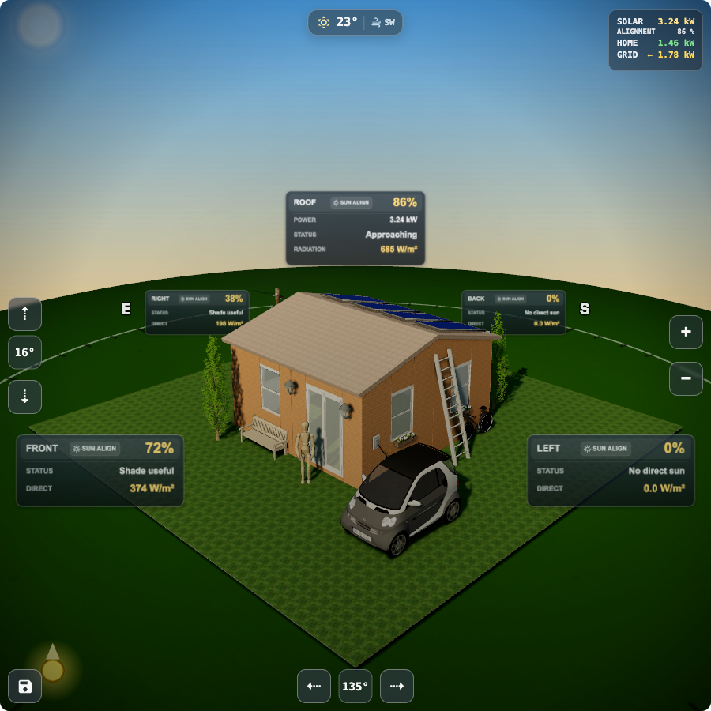
</p>

<table>
  <tr>
    <th>🌙 From daylight to night lighting</th>
    <th>❄️ Weather that becomes part of the scene</th>
  </tr>
  <tr>
    <td>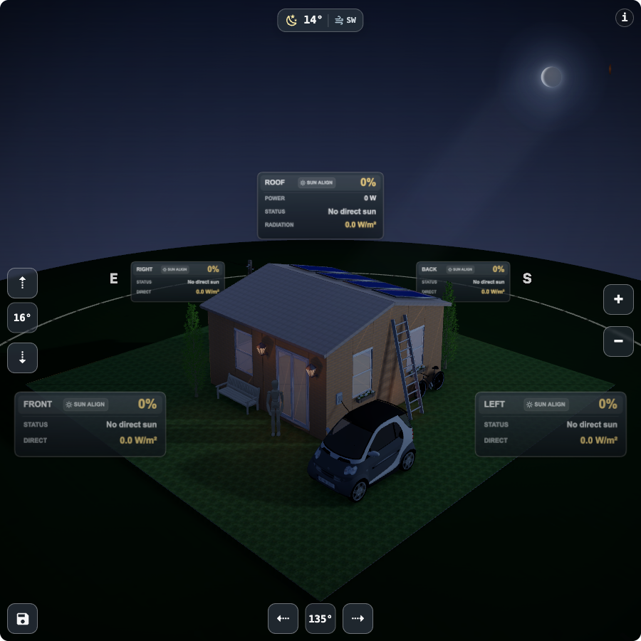</td>
    <td>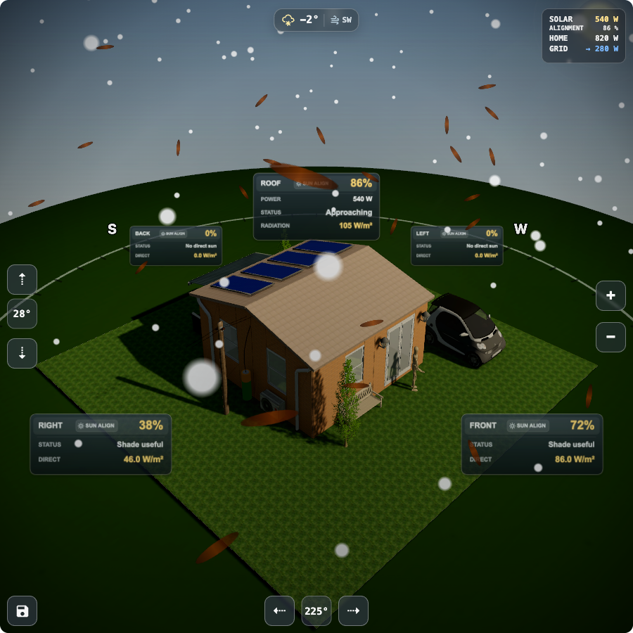</td>
  </tr>
</table>

*Actual card screenshots using the bundled 3D house and illustrative sensor/weather data. Configure the house orientation and roof tilt for your installation.*

[](https://my.home-assistant.io/redirect/hacs_repository/?owner=NoUsername10&repository=Sunlight_Visualizer&category=integration)

[Installation](#installation) · [Full setup guide](https://github.com/NoUsername10/Sunlight_Visualizer/wiki) · [What's new in 0.5.0](RELEASE_NOTES.md)

## ✨ Features in short

- 🏡 **Interactive 3D house included** — explore the scene with sunlight, shadows, solar panels and day/night lighting.
- ☀️ **Sun awareness for every wall and the roof** — see alignment, sun angle and roof alignment trends at a glance.
- 🪟 **Sensors for smarter shading and comfort** — use sun exposure and optional shading demand in your own blind, awning and HVAC automations.
- 🌦️ **Optional Open-Meteo weather** — clouds, rain, snow, fog, wind gusts and lightning, plus temperature, wind and weather details.
- ⚡ **Energy overview built into the card** — display solar, home and grid power using your existing sensors, with optional EV charging information.
- 📈 **Tap a surface to explore its values** — open graph dialogs from wall and roof signs and compare sun alignment, radiation and shading information.
- 👆 **Touch and mouse controls** — drag to rotate, pinch or scroll to zoom, auto-rotate, and save your favourite camera view.
- 🪶 **A lightweight 2.5D option** — choose 3D, SVG-based 2.5D, or Automatic mode with fallback when 3D is unavailable.
- 💤 **Pauses when out of view** — 3D rendering and weather stop when the whole card is offscreen, then resume when it returns.
- 🛠️ **Visual setup and card editor** — configure the integration through Home Assistant and add the card from the dashboard card picker.
- 🔌 **Core sun sensors work without an external weather API** — enable Open-Meteo separately for forecast radiation, shading and 3D weather.
- 🌍 **26-language interface** — translated setup, options, services, card editor, controls, weather details, graphs and 3D surface information.

## 🌍 In your language

The interface follows your Home Assistant language, with English as the fallback.

🇬🇧 English · 🇩🇪 Deutsch · 🇳🇱 Nederlands · 🇨🇿 Čeština · 🇵🇱 Polski · 🇵🇹 Português · 🇧🇷 Português (Brasil)

🇪🇸 Español · 🌎 Español (Latinoamérica) · 🇮🇹 Italiano · 🇫🇷 Français · 🇸🇪 Svenska · 🇩🇰 Dansk · 🇳🇴 Norsk bokmål

🇫🇮 Suomi · 🇱🇹 Lietuvių · 🇨🇳 简体中文 · 🇯🇵 日本語 · 🇹🇭 ไทย · 🇻🇳 Tiếng Việt

🇧🇬 Български · 🇬🇷 Ελληνικά · 🇭🇺 Magyar · 🇷🇴 Română · 🇹🇷 Türkçe · 🇺🇦 Українська

**Ready to try it?** Install through HACS, add the integration, then add the Sunlight Visualizer card to your dashboard. Home Assistant **2026.1.0 or newer** is required.

> **Want the full guide?** Find setup instructions, sensor explanations, automation examples and troubleshooting in the [Sunlight Visualizer Wiki](https://github.com/NoUsername10/Sunlight_Visualizer/wiki). See the [release notes](RELEASE_NOTES.md) for upgrade instructions and known limitations.

[](https://www.buymeacoffee.com/DefaultLogin)

## Installation
### HACS - Recommended
1. Open HACS.
2. Search for **Sunlight Visualizer**.
3. Install **Sunlight Visualizer**.
4. Restart Home Assistant.
5. Add the integration from **Settings → Devices & services → Add integration → Sunlight Visualizer**.
6. Add the card from the Lovelace card picker.

For normal HACS installs, the integration registers the Lovelace card resource automatically. You should not need to add a card resource manually.

<details>
<summary>Manual / non-HACS install backup</summary><br>

If you do not use HACS, copy `custom_components/sunlight_visualizer` into your Home Assistant `custom_components` folder, restart Home Assistant, then add the Lovelace resource manually as a JavaScript module:

```text
/sunlight_visualizer/sunlight-visualizer-card.js?v=0.5.0
```

The `?v=0.5.0` query string is a cache-busting version marker. It helps browsers load the new card bundle after updates.

</details>

## Basic Setup
<p>
  
  
</p>

**Default setup uses your Home Assistant Home location.** If you need a different place, choose a `zone.*` override. If the selected zone is removed or unavailable, the integration safely falls back to Home.

During setup/options you configure:
- **Zone override:** `Use Home (default)` or a custom `zone.*`.
- **House direction:** compass direction or exact angle for the front door.
- **Roof direction:** which side the roof slopes toward.
- **Ceiling/roof tilt:** used for roof sun and radiation calculations.
- **Update interval:** how often geometric sun values update.
- **Open-Meteo radiation sensors:** optional and disabled by default.
- **3D weather visuals:** optional Open-Meteo current-weather data for the GLB renderer, disabled by default.
- **Roof power sensor:** optional power value for the roof/card/HUD.

When Open-Meteo is enabled, the integration fetches 15-minute forecast radiation data. While the sun is up it refreshes every 15 minutes; when the sun is down it refreshes hourly. The latest successful same-day forecast is cached so sensors can keep working if a later API call fails.

## Default Sensors
<p>
  
</p>

These sensors are always available without any external weather API:
- **Wall Sun Alignment:** geometric `%` for each wall. Higher means that wall faces the sun more directly.
- **Wall Sun Angle:** `0°` when inactive, otherwise `90 - sun elevation`. Higher means lower sun and deeper light entry through windows.
- **Roof Sun Alignment:** geometric roof-facing `%` using house angle, roof direction, and roof tilt.
- **Roof Sunlight Alignment Percentage:** how close the roof is to today’s best geometric roof alignment.
- **Roof Sunlight Alignment Status:** whether roof alignment is approaching or declining.
- **Sun diagnostics:** azimuth, elevation, and active coordinates.

A simple blind/awning automation can start with **Wall Sun Alignment** and **Wall Sun Angle**. For example: close when a wall has alignment above `20%` and sun angle above `45°`.

## Optional Open-Meteo Sensors
<p>
  
  
  
</p>

Open-Meteo support is opt-in because it uses an external API. When enabled, the integration adds radiation and shading sensors while keeping the default sun-alignment sensors unchanged.

For each wall:
- **Wall Radiation Direct:** direct beam radiation hitting that wall (`W/m²`). This is `0` when the wall has no direct sun.
- **Wall Radiation Total:** direct + diffuse sky + reflected ground radiation (`W/m²`). This can be non-zero even when a wall is not directly lit.
- **Wall Shading Demand:** automation-friendly `%` based on direct radiation and a comfort/elevation curve.
- **Wall Shading Status:** text guidance such as `No direct sun`, `Shade useful`, or `Strong low sun`.

For the roof:
- **Roof Radiation:** forecast-adjusted radiation currently hitting the roof (`W/m²`).
- **Roof Radiation Percentage:** roof radiation relative to today’s forecast peak for that roof.

Open-Meteo can also clean up its own radiation entities when you disable it. In options, uncheck **Remove Open-Meteo sensors when disabling** if you want to keep those entity IDs for later.

| Sensor | Best use |
| --- | --- |
| `Wall Sun Alignment` | Geometry: is this wall facing the sun? |
| `Wall Sun Angle` | Comfort: is the sun low enough to enter deeply? |
| `Wall Radiation Direct` | Physics: how much direct sun hits this wall? |
| `Wall Radiation Total` | Information: all estimated radiation on the wall. |
| `Wall Shading Demand` | Automation: should blinds/awnings probably react? |
| `Wall Shading Status` | Dashboard text for humans. |
| `Roof Radiation Percentage` | How close the roof is to today’s radiation peak. |

## Optional 3D Weather Visuals
Open-Meteo weather visuals are a separate opt-in layer for the full 3D renderer. Enable **3D weather visuals** in the integration options, then choose the visual strength in the card editor.

The integration provides a `3D Weather` entity and the card can show:
- drifting clouds and daylight dimming,
- rain, snow, and fog,
- wind-direction-aware leaf gusts,
- animated horizon lightning during thunderstorms,
- a compact weather chip with condition, temperature, and wind direction,
- a detailed popup with current conditions, wind, visibility, and sunrise/sunset information.

Card visual strengths are `Automatic`, `Subtle`, `Normal`, `Strong`, and `Off`. Automatic adapts the effects to the reported weather. These effects are GLB/3D-only: the complete 2.5D SVG renderer remains unchanged, and disabling the weather option leaves the core sunlight integration behavior intact.

## Diagnostics
<p>
  
  
</p>

Default diagnostics show the sun position and the coordinates currently used by the integration. With Open-Meteo enabled, diagnostics also show raw API radiation values and **Open-Meteo Radiation Status**.

The status sensor is intentionally text-based. `OK` means the latest API data is healthy. Error/stale states expose attributes such as latest successful update, minutes since success, fetch attempts, API status, and last error.

## Renderer Modes

<details>
<summary>See the lightweight 2.5D view</summary>

<p>
  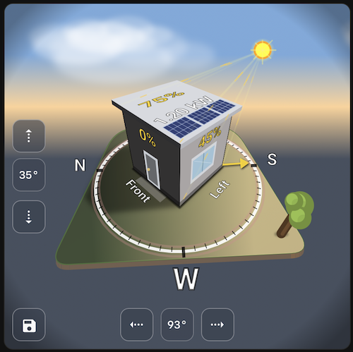
  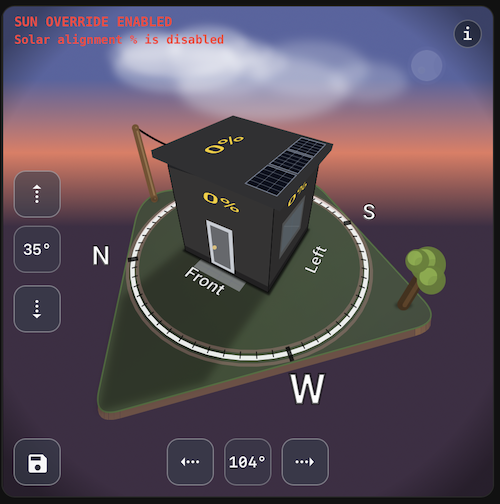
  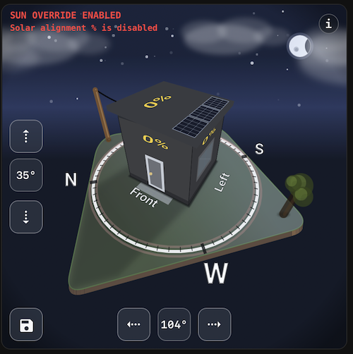
</p>


</details>

The card provides three clear renderer choices. Cards without an explicit selection use **Automatic**.

| Renderer | What it does |
| --- | --- |
| **Automatic** | Checks WebGL and loads the full 3D house. If WebGL or the model is unavailable, it safely switches to the complete 2.5D scene. |
| **2.5D** | Uses only the complete SVG visualizer. It does not create a WebGL context or download the GLB model. |
| **3D** | Uses only the complete GLB/WebGL scene. It does not generate a hidden SVG scene, but still falls back safely if 3D initialization fails. |

> Prefer the previous SVG presentation? Select **2.5D** manually in the card editor. Automatic is the new default and does not silently preserve the old renderer choice.

Automatic and 3D modes show a dedicated loading screen while the model is prepared. The bar uses real browser download progress when the server supplies a total size, switches to an indeterminate animation when it does not, and reports when a fallback is needed. The 2.5D house is not drawn underneath, so first load does not flash between renderers.

## Visual Card Configuration
<p>
  
  
  
</p>

The visual editor is designed so most users do not need YAML. It includes:
- **Renderer:** choose `Automatic`, `2.5D`, or `3D`.
- **Size and layout:** card width/height, auto-scale width, and preview pane.
- **House and roof:** house direction, roof direction, roof tilt, and camera rotation.
- **Surface `%` labels:** choose what percentage is painted on walls and roof.
- **Grid connection:** grid flow sensor, sign inversion, power pole, power cable, and power pulse.
- **EV charging:** car charger power sensor, 2.5D SVG EV visibility, and charger pulse.
- **Roof power:** optional roof/solar power sensor and invert support.
- **Energy HUD:** show/hide HUD, auto-compact behavior, roof alignment details, and opacity.
- **3D weather visuals:** choose Automatic, Subtle, Normal, Strong, or Off when the integration weather option is enabled.
- **Auto-rotate:** default card rotation speed.

## EV Charging Visual
The complete 2.5D renderer includes an optional SVG EV car controlled by **Show EV car in 2.5D**. The strict 3D renderer displays the contents authored into its GLB house model and does not overlay the retired experimental Smart car/Mini SUV selector.

The renderer boundary is intentional: 2.5D does not create WebGL car resources, and 3D does not place Three.js objects over a hidden SVG house. If Automatic or 3D cannot initialize WebGL/the GLB house, the whole card falls back to 2.5D rather than mixing the two renderers.

When a valid car charger power sensor is selected, the HUD can show `CAR`, and the charger cable pulse animates toward the car while charging.

## Auto Binding + Surface % Sources
The card tries to bind integration entities automatically. In most installations you can add the card and it will find the Sunlight Visualizer sensors by their integration source attributes.

Wall percentage source options:
- `auto` — default. Uses `Wall Shading Demand` when Open-Meteo shading sensors are valid; otherwise uses `Wall Sun Alignment`.
- `sun_alignment` — always uses geometric wall sun alignment.
- `shading_demand` — uses Open-Meteo shading demand when available, with safe fallback to sun alignment.

Roof percentage source options:
- `roof_sun_alignment` — default geometric roof sun alignment.
- `roof_radiation_percentage` — Open-Meteo roof radiation relative to today’s roof peak.
- `roof_sunlight_alignment_percentage` — roof optimal-alignment timing percentage.

Legacy manual entity overrides still work when the new source selectors are not explicitly set. For new setups, the visual selectors are recommended.

## Sensor Visual Guide
<details>
<summary>Open the visual sensor guide</summary><br>

These diagrams explain how the main values relate to each other.

<p>
  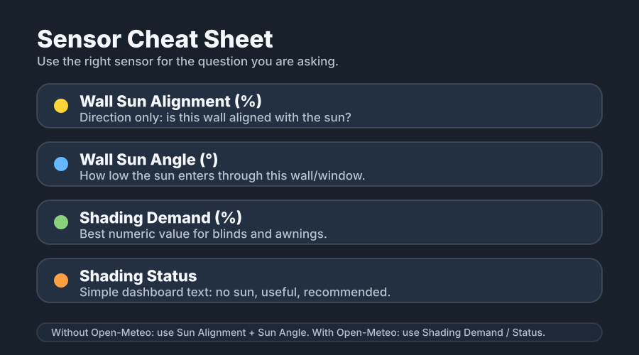
</p>

<p>
  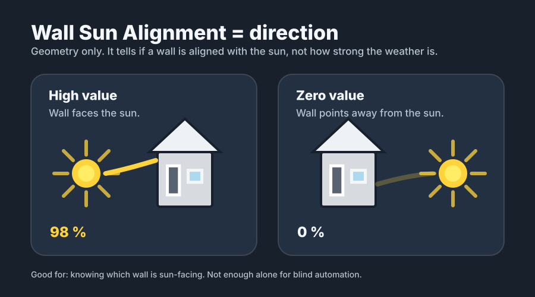
</p>

<p>
  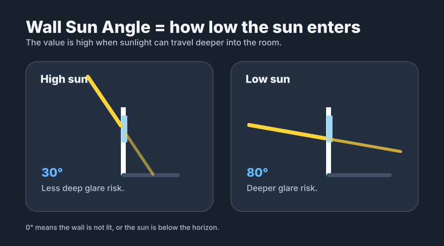
</p>

<p>
  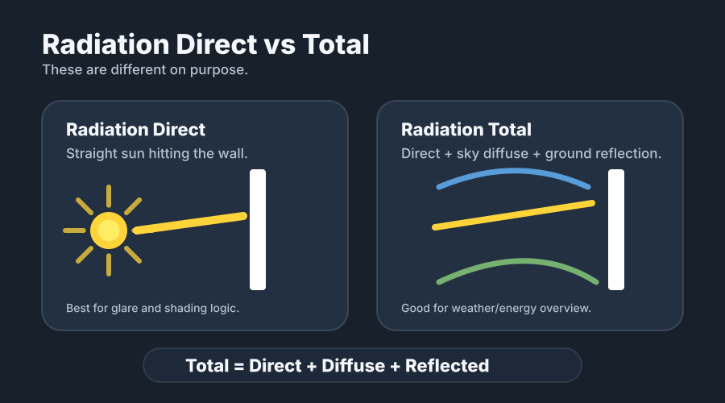
</p>

<p>
  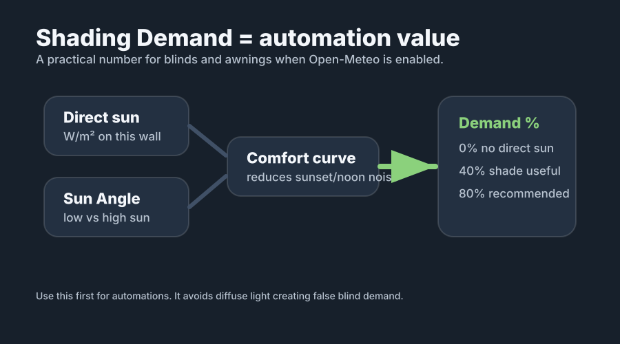
</p>

<p>
  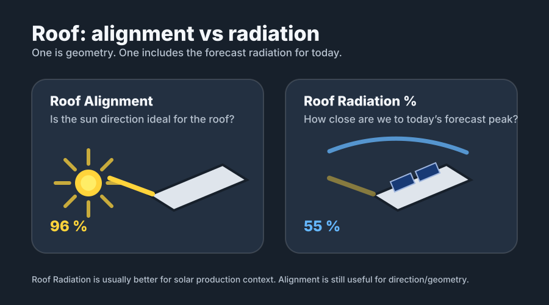
</p>

For deeper examples and troubleshooting, use the [Wiki](https://github.com/NoUsername10/Sunlight_Visualizer/wiki).
</details>

## What The Integration Creates
<details>
<summary>Entity overview</summary><br>

### Always-on sensors
- `sensor.front_wall_sunlight`, `sensor.right_wall_sunlight`, `sensor.back_wall_sunlight`, `sensor.left_wall_sunlight` — friendly names are `Front/Right/Back/Left Wall Sun Alignment`. Entity IDs stay stable from earlier releases.
- `sensor.front_wall_sun_angle`, `sensor.right_wall_sun_angle`, `sensor.back_wall_sun_angle`, `sensor.left_wall_sun_angle` — wall sun-entry angle (`°`). Returns `0°` when the wall is not lit or the sun is down.
- `sensor.roof_sunlight` — friendly name `Roof Sun Alignment`. Entity ID stays stable from earlier releases.
- `sensor.roof_sunlight_alignment_percentage` — roof optimal-alignment timing percentage (`%`).
- `sensor.roof_sunlight_alignment_status` — roof alignment trend/status text.
- `sensor.sun_azimuth`, `sensor.sun_elevation`, `sensor.sun_coordinates` — diagnostic sun/location values.

### Open-Meteo sensors, only when enabled
- `sensor.open_meteo_radiation_status` — diagnostic API/cache status.
- `sensor.open_meteo_shortwave_radiation`, `sensor.open_meteo_direct_radiation`, `sensor.open_meteo_diffuse_radiation`, `sensor.open_meteo_direct_normal_irradiance` — raw diagnostic Open-Meteo values.
- `sensor.front_wall_radiation_total`, `sensor.right_wall_radiation_total`, `sensor.back_wall_radiation_total`, `sensor.left_wall_radiation_total` — `Front/Right/Back/Left Wall Radiation Total` (`W/m²`).
- `sensor.front_wall_radiation_direct`, `sensor.right_wall_radiation_direct`, `sensor.back_wall_radiation_direct`, `sensor.left_wall_radiation_direct` — `Front/Right/Back/Left Wall Radiation Direct` (`W/m²`).
- `sensor.front_wall_shading_demand`, `sensor.right_wall_shading_demand`, `sensor.back_wall_shading_demand`, `sensor.left_wall_shading_demand` — wall shading demand (`%`).
- `sensor.front_wall_shading_status`, `sensor.right_wall_shading_status`, `sensor.back_wall_shading_status`, `sensor.left_wall_shading_status` — wall shading status text.
- `sensor.roof_radiation`, `sensor.roof_radiation_percentage` — roof forecast radiation and percentage of today’s roof peak.
- `3D Weather` — optional current-weather entity used by the GLB weather chip, popup, and visual effects when 3D weather is enabled.

### Number entities
- `number.house_angle` — exact front-door direction in degrees.
- `number.ceiling_tilt` — roof/solar panel tilt.
- `number.update_interval` — sun calculation update interval.
- `number.house_camera_rotation_h`, `number.house_camera_rotation_v` — card camera defaults.

### Select entities
- `select.house_direction` — compass direction for the front door. Selecting `Custom` preserves the current orientation; set the exact value with `number.house_angle`.
- `select.roof_direction` — roof downhill side.

### Switch entities
- `Fixed sun position, azimuth. (Rotate scene)` — configuration switch that keeps the sun visually fixed and rotates the scene. Home Assistant assigns its entity ID and preserves an existing customized ID.

Auto-rotate speed, forced sun fallback, roof power label visibility, and roof power inversion are integration/card options rather than separate entities.

</details>

## Advanced YAML Reference
<details>
<summary>Core / Binding</summary><br>

```yaml
rendererMode: auto # auto | two_point_five_d | three_d

cardWidth: 450
cardHeight: 450
autoScaleWidth: true
preferIntegrationSettings: true

siSourceAttr: sunlight_visualizer_source
siSourceValue: sunlight_visualizer

rotationHEntity: number.house_camera_rotation_h
rotationVEntity: number.house_camera_rotation_v
houseAngleEntity: number.house_angle
fixedSunRotationEnabled: false
fixedSunAzimuthDeg: 225

# Legacy manual overrides. Normally leave these unset and use auto-binding/source selectors.
wallFrontPctEntity: sensor.front_wall_sunlight
wallRightPctEntity: sensor.right_wall_sunlight
wallBackPctEntity: sensor.back_wall_sunlight
wallLeftPctEntity: sensor.left_wall_sunlight
roofPctEntity: sensor.roof_sunlight

# Percentage painted on wall and roof surfaces
wallPercentSource: auto # auto | sun_alignment | shading_demand
roofPercentSource: roof_sun_alignment # roof_sun_alignment | roof_radiation_percentage | roof_sunlight_alignment_percentage

roofPowerEntity: null
roofPowerEnabled: false
roofPowerInvert: false
gridFlowEntity: null
gridFlowInvert: false
carChargerEntity: null

energyHudEnabled: true
energyHudAutoCompact: true
energyHudRoofAlignmentEnabled: true
energyHudCompactAtPx: 360
energyHudUltraCompactAtPx: 300
energyHudOpacity: 0.45

miniEvCarEnabled: true

sunAzEntity: null
sunElEntity: null
useSunEntity: false
sunEntityId: sun.sun
```
</details>

<details>
<summary>House / Roof / Surface Labels</summary><br>

```yaml
houseAngle: 0
roofTiltEnabled: true
roofTiltDeg: 25
roofTiltFace: front
roofTiltMax: 89
roofTiltOpacity: 1.0

houseStyleV2: true
flatRoofEnabled: true
flatRoofOverhang: 0.15
flatRoofThickness: 0.12
flatRoofTopColor: "#e6e8ee"
flatRoofSideColor: "#9ea4af"

wallWindowsEnabled: true
frontDoorEnabled: true
roofPanelsEnabled: true

surfaceLabelEnabled: true
surfaceLabelSize: 25
surfaceLabelOffset: 0.03
wallPctVisibleThreshold: -0.215
wallPctAreaThreshold: 120
wallPctVerticalPos: 0.66
roofPctLabelScale: 1.18
roofPowerLabelScale: 0.70

floorWallLabelSize: 12
floorWallLabelOffset: 0.85
floorWallLabelScaleBoost: 1.2
floorWallLabelScaleMin: 0.5
floorWallLabelScaleMax: 1.8
```
</details>

<details>
<summary>Powerline / Energy HUD / EV</summary><br>

```yaml
powerlineEnabled: true
powerlinePulseEnabled: true
powerlinePulseIntervalSec: 5
powerPoleX: 2.2
powerPoleZ: 2.2

# Optional whole-house/grid flow source, power sensor only.
gridFlowEntity: null
gridFlowInvert: false

# Optional EV charger source, power sensor only.
carChargerEntity: null

# Energy HUD.
energyHudEnabled: true
energyHudAutoCompact: true
energyHudRoofAlignmentEnabled: true
energyHudCompactAtPx: 360
energyHudUltraCompactAtPx: 300
energyHudOpacity: 0.45

# Optional SVG EV car in the 2.5D renderer.
miniEvCarEnabled: true

# Below 300x300 the HUD uses clickable (i) mode.
# At night the HUD can collapse automatically to avoid moon overlap.
```
</details>

<details>
<summary>Visual Environment</summary><br>

```yaml
weatherVisuals: automatic # off | automatic | subtle | normal | strong; GLB/3D only

shadowEnabled: true
sunlightEnabled: true
facadeSunDimmingEnabled: true
horizonEnabled: true
skyCloudsEnabled: true
skyStarsEnabled: true
skyMoonEnabled: true
moonlightEnabled: true
sunBeamFlowEnabled: true
sunRayAnimEnabled: true
backTreeEnabled: true
floorGrassEnabled: true
```
</details>

<details>
<summary>Rotation / Performance</summary><br>

```yaml
autoRotateEnabledDefault: false
autoRotateSpeed: 25
autoRotateIntervalMs: 50
autoRotateStopOnFullTurn: true
autoRotateTurnCount: 1
autoRotateShowFps: true
autoRotateAdaptiveEnabled: true
cssFpsDebugEnabled: false
cssFpsAutoLimitEnabled: true
```
</details>

## Validation / Localization / Notes
- Release version: `0.5.0`; requires Home Assistant `2026.1.0` or newer.
- HACS-friendly resource registration is handled by the integration.
- HACS/Hassfest validation is expected for release checks.
- Backend release smoke tests run against Home Assistant `2026.1.0` and the latest stable release, covering core calculations, coordinator refresh/cache behavior, config-entry setup, and bundled asset registration. See [`tests/README.md`](./tests/README.md).
- Integration setup/options/services and card interface translations: English, German, Dutch, Czech, Polish, European Portuguese, Brazilian Portuguese, Spanish, Latin American Spanish, Italian, French, Swedish, Danish, Norwegian Bokmål, Finnish, Lithuanian, Simplified Chinese, Japanese, Thai, Vietnamese, Bulgarian, Greek, Hungarian, Romanian, Turkish, and Ukrainian.
- Existing sensor entity IDs and friendly names are unchanged; entity friendly names remain English.
- Translation validation checks all backend and frontend locale files for exact key coverage and placeholder safety as part of `npm run check`.
- In Force Sun Fallback mode, the card displays `SUN OVERRIDE ENABLED` and disables live solar-alignment calculation for testing.
- The [Wiki](https://github.com/NoUsername10/Sunlight_Visualizer/wiki) has the deeper setup guide, automation examples, troubleshooting steps, and sensor explanations.

## Changelog
See [`CHANGELOG.md`](./CHANGELOG.md).
